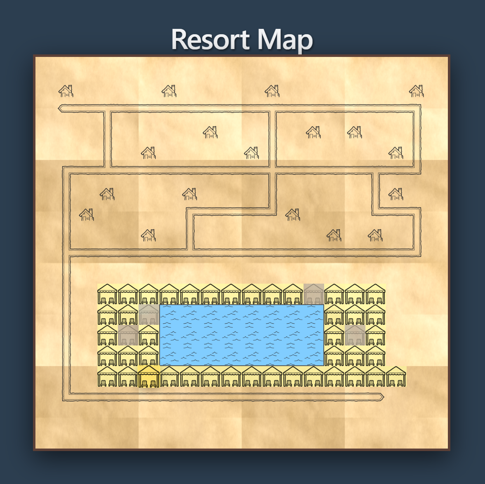
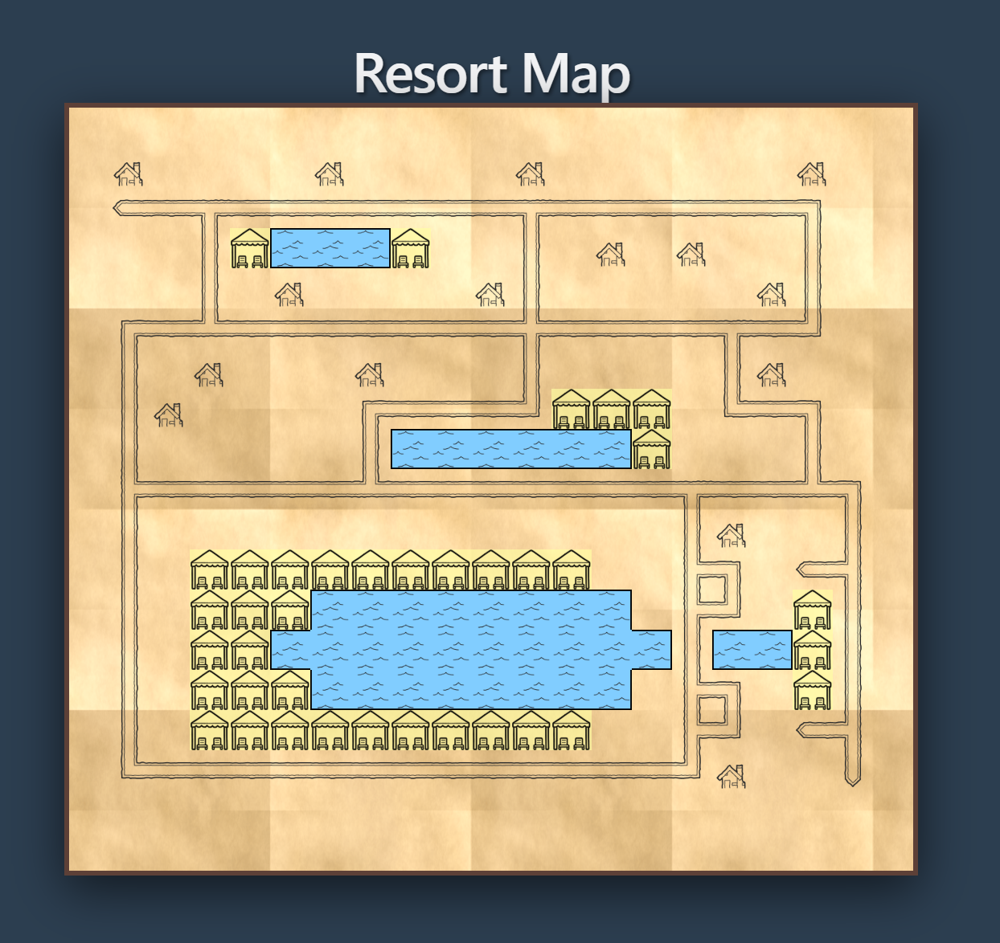

# Resort Map

A full-stack web application for visualizing a resort map and managing cabana reservations. Built with React (Vite) on the frontend and Express (Node.js) on the backend.

## Run

First run:
- `cd frontend && npm install`
- `cd ../backend && npm install`
- `cd ..`

Then use script from root directory:
- `./run.sh --map map.ascii --bookings bookings.json`

The command starts both services:
- backend at `http://localhost:3001`
- frontend at `http://localhost:5173`

### Custom Data Files (CLI Arguments):
You can pass custom files for the map and bookings using the --map and --bookings arguments. The run.sh script securely passes these down to the backend.
- `./run.sh --map custom-map.ascii --bookings custom-bookings.json`

### API endpoints
- `GET /api/map` → returns parsed map with booking status
- `POST /api/book` → book a cabana by x,y,room,guestName

## Tests

Run all tests:
- `npm test`

Run backend only:
- `npm --prefix backend test`

Run frontend only:
- `npm --prefix frontend test`

## Design decisions

### Backend Architecture
- **In-memory booking state**: `BookingService` uses a `Map<string, Booking>()` for session-only bookings for simplicity and no DB requirment.
- **Guest validation via file**: Guests are loaded once at startup into memory - no dynamic guest list updates.

### Frontend Rendering & Visualization
- **Pool visual grouping (not individual tiles)**: 
  - Instead of rendering individual `pool.png` tiles side-by-side for every (`p`) (which visually looks like a collection of many small paddles next to each other instead of one large pool) the frontend renders them as a **blue background** (`#81cdff`) with a **texture overlay**.
  - Instead of drawing individual borders, the component uses **CSS `inset` box-shadows only on edges where the neighbor is NOT water**.
  - Result: Pool tiles visually **merge together** and are surrounded by a **dark contour** (#505050) only at boundaries touching non-pools.

- **Cabana state styling**:
  - For clear UX feedback cabanas are styled differently depending on their availability.
  - Available cabanas: yellow background, clickable, hover scale+glow.
  - Booked cabanas: grayscale filter + reduced brightness, cursor disabled, image opacity reduced.

- **Path asset rotation**:
  - The backend map parser remains "dumb" and simply serves the raw grid coordinates and tile types (`#` for path). The frontend `pathHelper` dynamically examines neighbors to render the correct sprite (straight, corner, crossing, T-junction) and its rotation.
  - This keeps the backend decoupled from visual concerns and the payload small, at the cost of slight client-side computation.

### API Design
- **`/api/book` endpoint**: POST validates x,y,room,guestName in one call.

### Frontend Structure
- **Single-page, no routing**: All interaction on one view.
- **Modal overlay for booking**: Prevents accidental clicks behind modal.
- **Auto-refresh map after booking**: Load `/api/map` again to display updated `booked` flags.

## Screenshots

## Content
- Backend: `backend/`
- Frontend: `frontend/`
- Single entrypoint command: `run.sh` + args
- Tests: `backend/tests` + `frontend/src/components/*.test.tsx`
